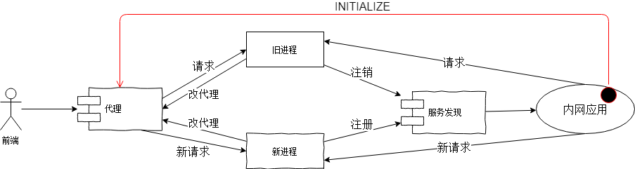
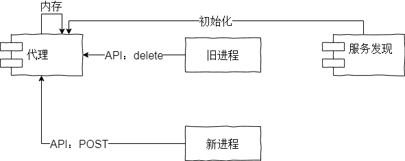

# 动态代理在业务上的应用设计与落地

## 摘要
在敏捷开发实践过程中，有一个环节或多或少会被忽略，那便是发版过程。

发版过程中，服务端存在一种不稳定的状态，用户端可能会因此受到损失，而动态代理就是一种解决发版过程中服务器端不稳定状态的方案，利用前端代理的动态变更，以及后端服务的持续稳定性，确保用户无需为代码发版过程中的任何事情埋单。

## 关键词
| 动态代理 | 发版 | 持续稳定性 |
| ------- | ---- | --------- |

***

## 1. 需求分析
这里的“发版过程”，并不是指产品灰度发布，或者发版中的流程问题，而是指项目代码发布上线的操作本身。

代码发版过程中，存在旧代码失效、旧进程停止、新进程启动、新代码生效的交替过程，这个过程对用户端的请求产生最直接的影响；请求是否被抛弃？请求是否抛出异常码？请求是否执行到中途突然停止？请求的响应内容是否就是全部内容？

这个时候其实可以认为服务器端状态是不稳定的，发生任何事都有可能需要用户直接埋单。

## 2. 解决方案
代码发版过程中，开启新的进程，先不要停止旧进程，而是先向代理发起通知，剔除旧节点的代理，后续请求不再分发给该节点，该节点正常处理已经到达的请求，之后开始清退业务逻辑，比如定时任务停止新的触发、停止新的消息队列消费、注销服务发现之类、停止服务心跳等。

## 3. 业务应用
这里介绍一个应用在常规业务架构上的落地措施，使用简洁的技术和常用的手段，解决业务痛点。

### 3.1 落地架构

### 3.2 动态代理设计
这里介绍nginx的动态代理设计。

关键插件：ngx_http_lua_module； ngx_http_lua_module集成了lua解析器，可以实现在nginx里调用lua代码的功能，lua代码“几乎”可以达到C语言级别的性能，且ngx_lua的IO会委托给nginx的事件模型实现非阻塞，确保动态代理的高性能；关于ngx_lua的介绍请参见： https://github.com/openresty/lua-nginx-module

关键处理方法：内存操作；ngx_lua的shared_dict可以定义一个共享内存区域，所有nginx子进程均可以通过shared_dict分享数据，而且是内存操作，确保了即使是动态代理也有高性能；

动态代理流程：

	- nginx配置初始化lua代码，请求服务发现，获取节点列表，存入shared_dict
	- nginx配置API操作shared_dict
	- 新进程通过API添加shared_dict中的节点
	- 旧进程通过API删除shared_dict中的节点
	- nginx通过lua代码定时从服务发现同步最新的节点列表
	- 当请求到来，nginx代理先通过lua代码获取一个节点地址，再将请求分发给改节点
注意：这里没有设计如何确保代理与服务发现之间的数据一致性，具体实现应增加此设计。

### 3.3 进程节点设计
	- 启动新进程，启动完成之后，向服务发现发起注册，并向代理发起节点添加操作；
	- 同时旧进程向服务发现发起下线，并向代理发起节点删除操作；
	- 旧进程处理完所有外部请求，开始停止触发新的定时任务、停止新的消息队列消费；
	- 旧进程等待所有旧任务完成，自己发起进程停止操作，进程自然消亡；

## 4. 落地难点
	- 需要开发人员具备更多的运维知识，特别是nginx代理方面的知识
	- 需要开发人员熟悉lua代码编写
	- 很多应用都是每个应用固定一个端口，方便管理，这里需要至少占用2个端口，端口管理工作需要带来变革

## 参考文献
	- https://segmentfault.com/a/1190000007059973
