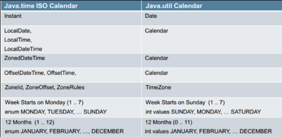

# 该不该接入java.time
> 原文地址： https://github.com/iorichina/iorichina.github.io/blob/master/blog/should-i-use-java.time.md
## 摘要
java8之前，我们都是使用自己或别人封装的时间处理方法，真正封装过时间处理方法的人就会知道，java8之前的原生日期时间处理API用起来还是很麻烦的；

不管是Date和Calendar都要处理并发问题，设置日期又要转成Calendar （java.util.Date的set方法大多是@Deprecated），常规的日期时间格式化和解析都要专门封装一套方法实现，同样要处理并发问题；

从java8开始推出专门处理日期时间的包java.time，号称专治各种日期时间处理疑难杂症；

java.time又有哪些优点缺点？我们是否需要将自己的代码切换到java.time？

## 关键词
| java1.8 | 日期时间API | Date | Calendar | java.time |
| ------- | ----------- | ---- | -------- | --------- |


## 总结
我的观点，新代码建议接入java.time，旧代码不改也不会影响性能、效率的情况下不建议特意改造为使用java.time。

## 接入的理由
### 线程安全
首先指出java.time的一点重要特性：`All the classes are immutable and thread-safe.`

福音啊，不再需要为并发处理烦恼，这一点相信也是群众最高的呼声之一吧。

对比以下代码你就知道：
old 
```
ThreadLocal<DateFormat> YEAR_MONTH_DATE_HH_MM_SS=new ThreadLocal<DateFormat>(){
	@Override
	protectedDateFormatinitialValue(){
		returnnewSimpleDateFormat("yyyy-MM-ddHH:mm:ss");
	}
};
@Test
public void test() {
	long now=1562083200;
	for(int i=0;i<10000;i++){
		new Thread(()->{
			int x=ThreadLocalRandom.current().nextInt(0,10);
			long seconds=YEAR_MONTH_DATE_HH_MM_SS.get()
				.parse("2019-07-03 00:00:0"+x).getTime() / 1000;
			Assert.assertEquals(now+x,seconds);
		}).start();
	}
}
```

VS
new 
```
DateTimeFormatter formatter = DateTimeFormatter.ofPattern("yyyy-MM-dd HH:mm:ss");
@Test
public void test() {
	long now=1562083200;
	for(int i=0;i<10000;i++){
		new Thread(()->{
			int x=ThreadLocalRandom.current().nextInt(0,10);
			long seconds=LocalDateTime.parse("2019-07-03 00:00:0"+x,formatter)
			.toEpochSecond(OffsetDateTime.now().getOffset());
			Assert.assertEquals(now+x,seconds);
		}).start();
	}
}
```

### 优雅的操作方法
很人性化的集成了一些日常使用到的格式使用方法，比如“LocalDate.parse("2017-08-09")”、“LocalDateTime.parse("2017-09-08T11:00:00")”；

链式编程，代码简洁，可读性也更强，比如取昨天第一秒的时间戳 
```
LocalDateTime.parse("2017-09-08 11:05:12", DateTimeFormatter.ofPattern("yyyy-MM-dd HH:mm:ss"))
	.minusDays(1)
	.truncatedTo(ChronoUnit.DAYS)
	.toEpochSecond(OffsetDateTime.now().getOffset())
```
、取这个月最后一纳秒的时间戳
```
LocalDateTime.now()
	.with(TemporalAdjusters.firstDayOfMonth())
	.plusMonths(1)
	.truncatedTo(ChronoUnit.DAYS)
	.minusNanos(1)
	.toEpochSecond(OffsetDateTime.now().getOffset())
```

从上面示例中其实也可以看到，日期时间的加、减、乘、除、格式化都还是挺方便的，简单易用。

### 更人性化
应该都知道旧日期API里，星期天是第一天，一月时第0个月，网上搜到的相关评语都是：what the *！

其实星期几是第一天这个我觉得还好，毕竟你看纸质的日历、windows 10之前的系统日历、苹果的日历，都是星期天作为每周的第一天，网上的评论更多是人云亦云，windows 10默认把星期一作为一周的第一天反而突然不习惯了！



月份这个，从0开始，跟其他的任何习惯都冲突，就真是反人类了。


### 漂亮的设计模式
java.time的API也做得非常符合当前代码的“审美观”，使用方法本文就不介绍了，可以参见文后我列出的参考。

## 不建议特意改造的理由
### 收益
只是修改java代码，对你来说也许可以说是学习，但是对公司来说又有什么收益？

在我看来，单纯的修改代码除了消耗工时以外，公司没有任何收益。

### 已封装的旧代码当然是线程安全的
一般来说，对于java日期时间的操作，我想很多人都会进行封装，以便快捷调用的同时符合自身的需求；

而已封装的旧代码一般是通过ThreadLocal或者新建一个对象来达到线程安全目的，java.time的线程安全同样是建立在每一个操作都新建对象的基础之上，当然这里并不是为了说新建个对象要花多大代价，而是说明前者与后者的方法本质都是一样的，参考内部实现的代码，也没发现有什么特别的性能提升，既然这个轮子开得好好的，就不应该特意停车下来换轮胎。

谁也不能保证你换了java.time的代码有没有bug，但起码旧代码时经过了生产环境的考验，而且还不用占用开发工时。

### 封装之后的代码都是优雅的
前面也说到，很多操作都经过封装，JDK自身代码的“优雅”特性对使用者而言是透明的。

所以java.time恶心的操作也“被优雅”了，比如取某个毫秒时间对应的当天第一毫秒：
```
public static long getTimestampInDayFirstMilli(long timeInMillis) {
	return ZonedDateTime
		.ofInstant(Instant.ofEpochMilli(timeInMillis), ZoneId.systemDefault())
		.truncatedTo(ChronoUnit.DAYS)
		.toInstant()
		.toEpochMilli();
}
public static long getTimestampInDayFirstMillis(long timeInMillis) {
	return LocalDateTime
		.ofInstant(Instant.ofEpochMilli(timeInMillis), ZoneId.systemDefault())
		.truncatedTo(ChronoUnit.DAYS)
		.atZone(ZoneId.systemDefault())
		.toEpochSecond() * MILLIS_PER_SECOND;
}
```
对于秒级的操作，java.time还算让人满意，但是一旦操作毫秒级或更小单位的时间戳，就显得很恶心了，非得转来转去。

## 题外话
### 时区
有些朋友可能注意到这里没有提及时区，java.time对整个日期时间的API 进行了一次“日历化”，对于时区的内容还是封装得很好的，但是对于日常开发来说，基本都是依靠操作系统的时区配置就够了，一些外贸外包代码会用时区比较多吧。

### 误区
网上看到过对时间类性能问题的讨论（包括国外的），说是System.nanoTime()多快多快，System.currentTimeMillis()多慢多慢，还列出了java的源码，但我觉得这根本不是快慢的问题，而是使用场景的问题；nanoTime适合period计算，currentTimeMillis也无需切换到内核态（linux下），放心使用就是了，java.time的根本就是基于currentTimeMillis。

> 参考：
* https://docs.oracle.com/javase/8/docs/api/java/time/package-summary.html
* https://www.jianshu.com/p/19bd58b30660
