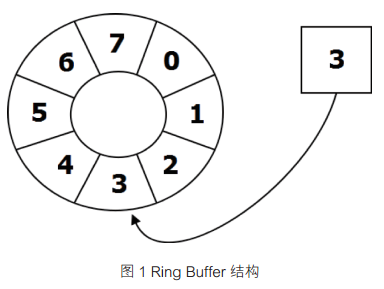

# 解析Disruptor如何实现无锁高并发编程


## 摘要
本文将通过Disruptor源码，解析其实现无锁并发编程的奥秘，以及应用到实际业务场景中的一些思考。  
Disruptor是一个金融交易系统中的一个高性能并发处理框架，允许开发者通过生产者-消费者模式，实现高效、并发、非阻塞处理事件。  
本文会通过具体的消息队列处理案例来进行解析。

## 关键字
并发编程; 无锁编程; 消息队列; CAS


## 1、Disruptor介绍
Disruptor是由LAMX开源的一个`High Performance Inter-Thread Messaging Library`；LAMX是一个事务型高性能交易系统，很多外汇交易公司都使用了他们的系统。

Disruptor最早是LAMX系统里的一个高效非阻塞算法，后来演变成了LMAX的核心基础组件。

Disruptor社区[Google Group](https://groups.google.com/group/lmax-disruptor)


## 2、无锁编程
业务场景中经常会出现需要异步处理其他模块产生的事件，而消息队列就很适合这种场景，但是为了保证数据的一致性，即不会发生多个线程同时处理某个事件，在消费队列事件时，会需要对事件数据加锁，以确保事件处理是串行的。

### 2.1 锁的低效与复杂度
锁的介入，会极大的提高消息处理的延迟，无法很好地利用多CPU并发，而且需要处理锁争抢、死锁等问题，线程越多，争抢锁带来的消耗越大，同时复杂度极大地提升。


### 2.2 引入Disruptor
DIsruptor通过`RingBuffer`这个数据结构，针对多核CPU的高速缓存特性进行优化；  
多个生产者能够并发无冲突地写数据到`RingBuffer`里；  
多个消费者处理事件过程中，不对消费的数据进行加锁，同时保证同一时刻只能有一个一个消费者能够处理此数据。

### 2.3 无锁的RingBuffer
RingBuffer如何实现的呢？  
先来看下RingBuffer的结构

[1]

`RingBuffer`由一个指针和多个元素组成，多个元素之间可以理解为一个环形的数组，通过指针来指向下一个可用的元素；  

这个指针是一个自增的序列号，所以需要通过指针的指取模元素的个数，得到指针指向的正确位置；  

每一个元素都对应一个序列号。

### 2.4 生产者

```
(RingBuffer)(new Disruptor(...).start()).publishEvent(...)
```
生产者会不断循环利用该环形数组进行数据存放，每一个数据被消费者处理之后，都不会立即进行删除，当存储耗尽时，生产者会对最老的数据进行覆盖存储，当然也可以设置为不覆盖抛弃事件；

来看下生产者生产的部分源码：
```
public final class RingBuffer<E>
    public <A, B, C> boolean tryPublishEvent(EventTranslatorThreeArg<E, A, B, C> translator, A arg0, B arg1, C arg2)
    {
        try
        {
            // 获取最后一个元素的指针序列号以及指向的位置，见下一段代码
            final long sequence = sequencer.tryNext();
            // 向指定位置写数据，并绑定序列号
            translateAndPublish(translator, sequence, arg0, arg1, arg2);
            return true;
        }
        catch (InsufficientCapacityException e)
        {
            return false;
        }
    }
}
```
```
//  获取最后一个元素的指针序列号以及指向的位置
public interface Sequencer {
    /**
     * @see Sequencer#tryNext(int)
     */
    public long tryNext(int n) throws InsufficientCapacityException
    {
        if (n < 1)
        {
            throw new IllegalArgumentException("n must be > 0");
        }

        long current;
        long next;

        do
        {
            current = cursor.get();
            next = current + n;

            if (!hasAvailableCapacity(gatingSequences, n, current))
            {
                throw InsufficientCapacityException.INSTANCE;
            }
        }
        // UNSAFE.compareAndSwapLong
        while (!cursor.compareAndSet(current, next));

        return next;
    }
}
```

可以看出，生产者实际是通过CAS实现无锁获取定位，再将数据set进指定位置，如果失败，该位置的值不会有任何改变。


### 2.5 消费者
Disruptor的消费者依赖`EventProcessor`循环处理可用事件；`EventProcessor`继承了`Runnable`，其实现方式分为单线程批量处理`BatchEventProcessor`和多线程处理器`WorkerProcessor`。[3]  
这里介绍多线程处理器`WorkerProcessor`，首先需要配置好事件处理器`WorkerProcessor`
```
disruptor.handleEventsWith(handler1, handler2, handler3, handler4);
disruptor.start();
```
```
public RingBuffer<T> start()
{
    checkOnlyStartedOnce();
    // 这里启动每一个事件处理器`WorkerProcessor`
    for (final ConsumerInfo consumerInfo : consumerRepository)
    {
        consumerInfo.start(executor);
    }

    return ringBuffer;
}
```
然后等待生产者生产事件之后，即`WorkerProcessor`处理器使用一个死循环，从`RingBuffer`里取事件，一旦取到事件，更新处理器已处理已经处理到的位置（即`RingBuffer`的序列号），并对事件进行处理
```
public final class WorkProcessor<T>
    implements EventProcessor
{
    @Override
    public void run()
    {
        ...
        while (true)
        {
            try
            {
                if (processedSequence)
                {
                    processedSequence = false;
                    do
                    {
                        nextSequence = workSequence.get() + 1L;
                        sequence.set(nextSequence - 1L);
                    }
                    while (!workSequence.compareAndSet(nextSequence - 1L, nextSequence));
                }

                if (cachedAvailableSequence >= nextSequence)
                {
                    event = ringBuffer.get(nextSequence);
                    // 事件处理
                    workHandler.onEvent(event);
                    processedSequence = true;
                }
                else
                {
                    cachedAvailableSequence = sequenceBarrier.waitFor(nextSequence);
                }
            }
            ...
        }

        notifyShutdown();

        running.set(false);
    }
}
```
其本质也是通过CAS实现互斥取事件，取出事件之后会通过`compareAndSet`更新当前事件处理器已经处理到的位置；  
以下是消费者（事件处理器）的示例代码：
```
public class TestWorkHandler implements WorkHandler<TestEvent>
{
    @Override
    public void onEvent(final TestEvent event) throws Exception
    {
        System.out.println(event.toString);
    }
}
```

## 3、Why Disruptor
通过上面的源码分析可以知道，Disruptor的“无锁”，本质是CAS的一种具体实现，但是很多代码都有实现CAS的利用啊，比如：
```
public final class String {
    public String(StringBuffer buffer) {
        synchronized(buffer) {
            this.value = Arrays.copyOf(buffer.getValue(), buffer.length());
        }
    }
}
```
在java 8及以上版本，jvm都会将`synchronized`优化成CAS的一个实现;  

那么为什么使用Disruptor而不是自己写个轮子呢？自己写的轮子可能更简单更易维护。  
这里根据上面的源码分析结果，进行一次解析。

### 3.1 多生产者
多生产者的时候，需要处理存储位置冲突的关系，`RingBuffer`的设计使得生产者可以从冲突关系中解脱出来，专心生产。

### 3.2 多消费者
Disruptor不管对单消费者还是多消费者，多消费者串行、并行或者串行并行共存的复杂处理，`EventProcessor`都能随心应用。

### 3.3 高并发效率
Disruptor的效率还是得在高并发的处理上才能体现出来，关键点还是在`RingBuffer`；  
`RingBuffer`预申请了空间，同时不会被GC，空间可以循环利用，可以“回看”数据，高性能实现，无锁设计等等。

## 4、业务应用

### 4.1 订单事件处理
发起一个消费订单之后，还有大量的事件需要处理；
比如直播平台送了一个礼物扣费成功之后，需要给主播加明星等级，给粉丝加财富等级，发送消费消息到消息队列，检查粉丝是否达到某个活动的获奖条件，向监控程序发送监控数据等等。

### 4.2 秒杀系统
高并发秒杀时，减库存是个最大的问题之一；  

提前把库存数据load到内存中，下单减库存，只需在单线程里消费`RingBuffer`，直到耗尽库存，其他事件立即返回秒杀失败。 

Disruptor绕过了并发编程的内存可见性、同步、锁等问题，性能非常强。[4]

服务进程down之后，相当于库存归还，其他进程自动load归还的库存到内存，接受订单。

当然还有更多的一些冲突需要处理，这里不展开。

### 4.3 异步日志处理
日志收集不应该影响业务，如果需要顺序性处理某些日志事件，那么Disruptor就非常适合集成到你的框架里。

## 5、注意点
- 32位的linux系统在`SleepingWaitStrategy`策略下，`LockSupport.parkNanos()`的代价非常大，不建议使用该策略


## 参考文献
    [1] 《无锁编程实现消息交换——高性能并发框架在交易系统中的应用》[朱星垠]
    [2] https://github.com/LMAX-Exchange/disruptor
    [3] https://www.jianshu.com/p/f4021e8141ad
    [4] https://github.com/chanjarster/artemis-disruptor-miaosha