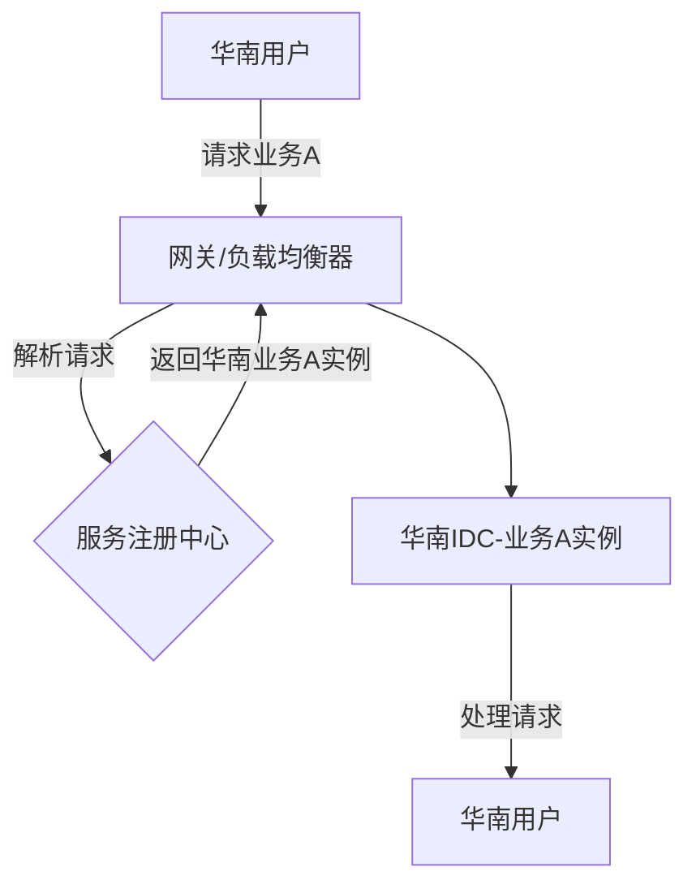
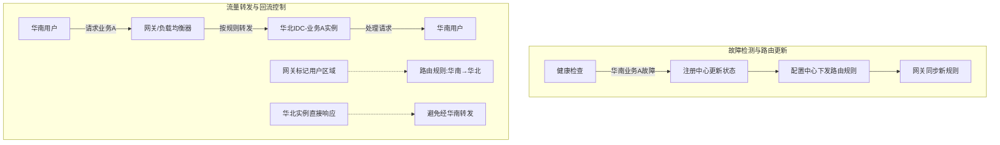
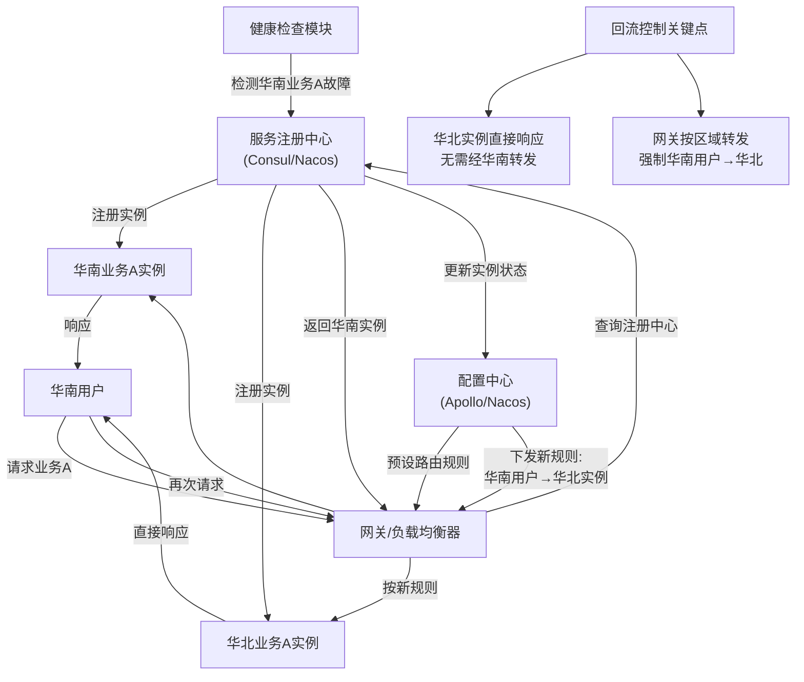
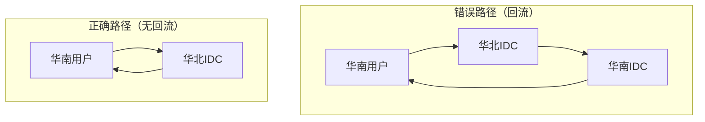
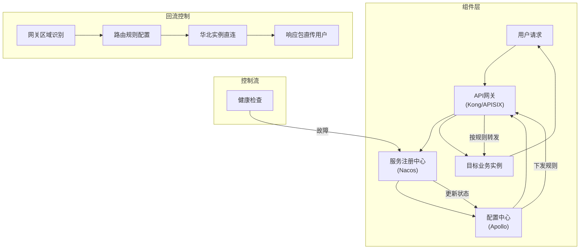

一、正常业务流量路径（华南 IDC 业务 A 正常）

```mermaid
graph TD
    A[华南用户] -->|请求业务A| B[网关/负载均衡器]
    B -->|解析请求| C{服务注册中心}
    C -->|返回华南业务A实例| B
    B --> D[华南IDC-业务A实例]
    D -->|处理请求| E[华南用户]

```

二、故障场景流量切换与回流控制（华南业务 A 故障）

```mermaid

graph TD
    subgraph "故障检测与路由更新"
        A1[健康检查] -->|华南业务A故障| B1[注册中心更新状态]
        B1 --> C1[配置中心下发路由规则]
        C1 --> D1[网关同步新规则]
    end
    
    subgraph "流量转发与回流控制"
        E1[华南用户] -->|请求业务A| F1[网关/负载均衡器]
        F1 -->|按规则转发| G1[华北IDC-业务A实例]
        G1 -->|处理请求| H1[华南用户]
        
        %% 回流控制细节
        I1[网关标记用户区域] -.-> J1[路由规则:华南→华北]
        K1[华北实例直接响应] -.-> L1[避免经华南转发]
    end

```

三、流量切换与回流控制详细流程图

```mermaid
graph TD
    %% 阶段1：系统组件初始化
    A["服务注册中心<br>(Consul/Nacos)"] -->|注册实例| B1[华南业务A实例]
    A -->|注册实例| B2[华北业务A实例]
    C["配置中心<br>(Apollo/Nacos)"] -->|预设路由规则| D[网关/负载均衡器]
    
    %% 阶段2：正常流量路径
    E[华南用户] -->|请求业务A| D
    D -->|查询注册中心| A
    A -->|返回华南实例| D
    D --> B1
    B1 -->|响应| E
    
    %% 阶段3：故障检测与路由更新
    F[健康检查模块] -->|检测华南业务A故障| A
    A -->|更新实例状态| C
    C -->|"下发新规则:<br>华南用户→华北实例"| D
    
    %% 阶段4：故障后流量路径（避免回流）
    E -->|再次请求| D
    D -->|按新规则| B2
    B2 -->|直接响应| E
    
    %% 回流控制标注
    G[回流控制关键点] --> H["华北实例直接响应<br>无需经华南转发"]
    G --> I["网关按区域转发<br>强制华南用户→华北"]

```

四、跨 IDC 响应路径对比

```mermaid

graph TD
    subgraph "错误路径（回流）"
        A[华南用户] --> B[华北IDC]
        B --> C[华南IDC]
        C --> A
        %% over B,C: "响应包经专线回华南再转发，<br>增加延迟与带宽消耗"
    end
    
    subgraph "正确路径（无回流）"
        D[华南用户] --> E[华北IDC]
        E --> D
        %% over E: "华北直接响应用户，<br>路径短、延迟低"
    end

```

五、技术组件协同流程图

```mermaid
graph TD
    subgraph "组件层"
        A[用户请求] --> B["API网关<br>(Kong/APISIX)"]
        B --> C["服务注册中心<br>(Nacos)"]
        C --> D["配置中心<br>(Apollo)"]
        D --> B
        B --> E[目标业务实例]
        E --> A
    end
    
    subgraph "控制流"
        F[健康检查] -->|故障| C
        C -->|更新状态| D
        D -->|下发规则| B
        B -->|按规则转发| E
    end
    
    subgraph "回流控制"
        G[网关区域识别] --> H[路由规则配置]
        H --> I[华北实例直连]
        I --> J[响应包直传用户]
    end
    
```